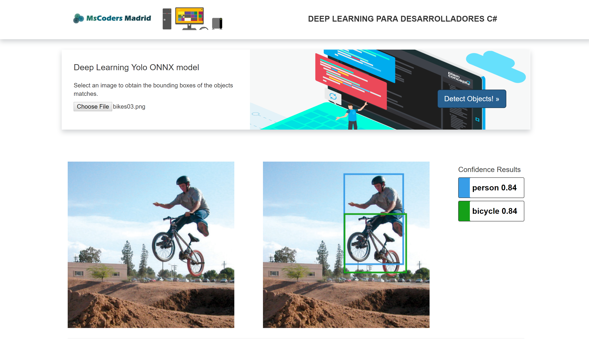

# Web application for image object detection using ML.Scoring C# Library for Inference, OpenCvSharp

## Description

Web application developed with ASP .Net Framework 4.6 that detect objects of an uploaded image using the YOLO v2 ONNX model and the [ML.Scoring](https://www.nuget.org/packages/Microsoft.ML.Scoring/) C# managed library for deep learning model inferencing that optimizes the ONNX/Tensorflow model for serving. The application also uses the OpenCVSharp to load the image and convert it to a Tensor ([Using the new Tensor class of System.Numerics](https://blogs.msdn.microsoft.com/dotnet/2017/11/15/introducing-tensor-for-multi-dimensional-machine-learning-and-ai-data/)) object to do some reshape operations in order to pass the correct dimensions to the model.

## Model description

### Input
shape `(1x3x416x416)`
### Preprocessing
### Output
shape `(1x125x13x13)`
### Postprocessing
The output is a `(125x13x13)` tensor where 13x13 is the number of grid cells that the image gets divided into. Each grid cell corresponds to 125 channels, made up of the 5 bounding boxes predicted by the grid cell and the 25 data elements that describe each bounding box (`5x25=125`).

## Setup

To run the web application it is necessary to add the following DLL's to the PATH because there are some packages (ML.Scoring and OpenCvSharp) that are using unmanaged DLL's. **The ML.Scoring package only runs in x64**

- Microsoft.ML.Scoring
- Microsoft.ML.ScoringNative
- mkl_avx
- mkl_avx2
- mkl_avx512
- mkl_core
- mkl_def
- mkl_intel_thread
- mkl_rt
- mkl_sequential
- mkl_vml_avx
- mkl_vml_def
- opencv_ffmpeg341_64
- OpenCvSharp.Blob
- OpenCvSharp
- OpenCvSharp.Extensions
- OpenCvSharp.UserInterface
- OpenCvSharpExtern
- tensorflow

To test the application you can use some sample images of the SampleImages folder.
